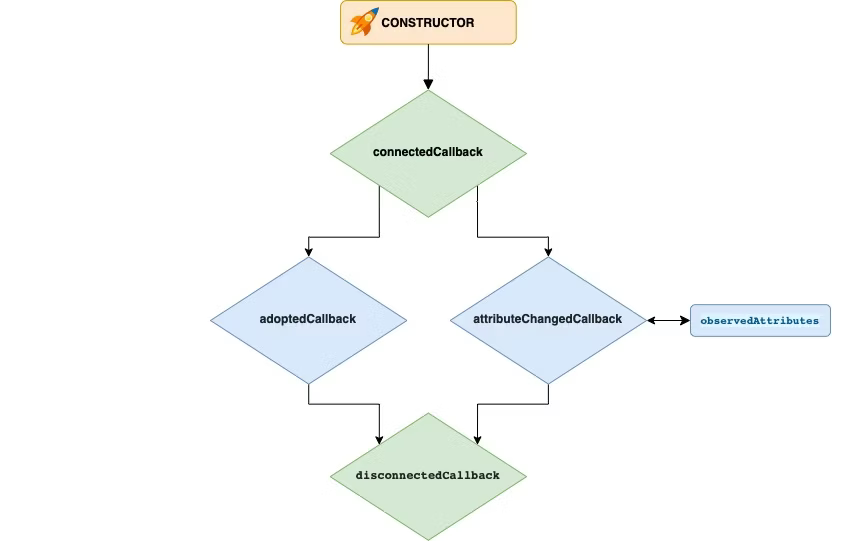

# Tipo de elemento personalizado (Custom Element)
Hay dos tipos de elemento personalizado:
- **Elementos personalizados autónomos** heredan de la clase base del elemento HTML class `HTMLElement`. Debes implementar su comportamiento desde cero.
```javascript
class CustomElement extends HTMLElement{
	// ...
}
```
- **Elementos personalizados integrados mejorados** heredan de elementos HTML estándar como `HTMLImageElement` o `HTMLParagraphElement`. Su implementación extiende el comportamiento de instancias seleccionadas del elemento estándar.
```javascript
class CustomImageElement extends HTMLImageElement{
	// ...
}
```

Para ambos tipos de elemento personalizado, los pasos básicos para crearlos y usarlos son los mismos:
1. Implementar su comportamiento definiendo una clase de Javascript.
2. Registrar el elemento personalizado en la página actual.
3. Finalmente, se puede usar el elemento personalizado en el código HTML o Javascript.
# Implementando un elemento personalizado

Implementación de un elemento personalizado mínimo que personaliza el elemento `<p>`:
```javascript
class WordCount extends HTMLParagraphElement {
	constructor(){
		super();
	}
}
```
Implementación de un elemento personalizado autónomo mínimo:
```javascript
class PopUpInfo extends HTMLElement {
	constructor(){
		super();
	}
}
```
>[!NOTE]
>En el `constructor` de la clase, se pueden configurar el estado inicial y los valores predeterminados, registrar event listeners y quizás crear un shadow root.
## Ciclo de vida de los elementos personalizados (lifecycle callbacks)
Una vez que tu elemento personalizado está registrado, el navegador llama a ciertos métodos de tu clase cuando el código en la página interactúa con tu elemento personalizado de ciertas maneras. Al proporcionar una implementación de estos métodos, que la especificación llama *lifecycle callbacks*, puedes ejecutar código en respuesta a estos eventos.

Los lifecycle callbacks de elementos personalizados incluyen:
- `connectedCallback()`: Se llama cada vez que el elemento se añade al documento.
>[!NOTE]
>La especificación recomienda que los desarrolladores implementen la configuración del elemento personalizado en este callback en lugar del constructor.
- `disconnectedCallback()`: Se llama cada vez que el elemento se elimina del documento.
- `connectedMoveCallback()`: Cuando está definido, se llama en lugar de `connectedCallback()` y `disconnectedCallback()` cada vez que el elemento se mueve a un lugar diferente en el DOM mediante `Element.moveBefore()`.
>[!NOTE]
>Úsalo para evitar ejecutar código de inicialización/limpieza en los callbacks `connectedCallback()` y `disconnectedCallback()` cuando el elemento no está siendo realmente añadido o eliminado del DOM. Ver Lifecycle callbacks and state-preserving moves
- `adoptedCallback()`: Se llama cada vez que el elemento se mueve a un nuevo documento.
- `attributeChangedCallback()`: Se llama cuando los atributos son cambiados, añadidos, eliminados o reemplazados. Ver Responding to attribute changes.


```javascript
// Crear una clase para el elemento
class MyCustomElement extends HTMLElement {
  // Lista de atributos que serán observados, lo que disparará `attributeChangedCallback`
  static observedAttributes = ["color", "size"];

  constructor() {
    // Siempre llamar a super primero en el constructor
    super();
  }

  connectedCallback() {
    console.log("Custom element added to page.");
  }

  disconnectedCallback() {
    console.log("Custom element removed from page.");
  }

  connectedMoveCallback() {
    console.log("Custom element moved with moveBefore()");
  }

  adoptedCallback() {
    console.log("Custom element moved to new page.");
  }

  attributeChangedCallback(name, oldValue, newValue) {
    console.log(`Attribute ${name} has changed.`);
  }
}

customElements.define("my-custom-element", MyCustomElement);
```
## Lifecycle callbacks y movimientos que preservan el estado

La posición de un elemento personalizado en el DOM se puede manipular igual que cualquier elemento HTML regular, pero hay efectos secundarios de ciclo de vida a considerar.
Cada vez que un elemento personalizado se mueve (mediante métodos como `Element.moveBefore()` o `Node.insertBefore()`), se disparan los lifecycle callbacks `disconnectedCallback()` y `connectedCallback()`, porque el elemento se desconecta y reconecta del DOM.
Si deseas preservar el estado del elemento, puedes hacerlo definiendo un lifecycle callback `connectedMoveCallback()` dentro de la clase del elemento, y luego usando el método `Element.moveBefore()` para mover el elemento (en lugar de métodos similares como `Node.insertBefore()`). Esto hace que se ejecute `connectedMoveCallback()` en lugar de `connectedCallback()` y `disconnectedCallback()`.
Podrías añadir un `connectedMoveCallback()` vacío para evitar que los otros dos callbacks se ejecuten, o incluir alguna lógica personalizada para manejar el movimiento:
```javascript
class MyComponent {
  // ...
  connectedMoveCallback() {
    console.log("Custom move-handling logic here.");
  }
  // ...
}
```

# Registrando un elemento personalizado
Para hacer que un elemento personalizado esté disponible en una página, llama al método `define()` de `window.customElements`.
El método `define()` toma los siguientes argumentos:
- `name`: Nombre del elemento. Debe comenzar con una letra minúscula, contener un guión, y cumplir con ciertas otras reglas listadas en la especificación.
>[!NOTE]
> Un nombre de string es un nombre válido de elemento personalizado si todo lo siguiente es verdadero:
> - *name* es un nombre de elemento local válido
> - El código de punto 0 de *name* es ASCII lower alpha
> - *name* no contiene ningún ASCII upper alpha
> - name no es uno de los siguientes ():
> 	- "annotation-xml"
> 	- color-profile"
> 	- "font-face"
> 	- "font-face-src"
> 	- "font-face-uri"
> 	- "font-face-format"
> 	- "font-face-name"
> 	- "missing-glyph"
> 	- ... otros nombres de elementos con guión de las especificaciones aplicables, namely SVG2 and MathML
- `constructor`: La función constructora del elemento personalizado.
- `options`: Solo se incluye para elementos personalizados integrados mejorados, es un objeto que contiene una única propiedad `extends`, que es un string que nombra el elemento integrado a extender.

Por ejemplo, este código registra el elemento personalizado integrado mejorado `WordCount`:
```javascript
customElements.define("word-count", WordCount, {
	extends: "p",
});
```

Este código registra el elemento personalizado autónomo `PopupInfo`:
```javascript
customElements.define("popup-info", PopupInfo);
```
# Usando un elemento personalizado
Para usar un elemento personalizado integrado mejorado, usa el elemento integrado pero con el nombre personalizado como valor del atributo `is`:
```html
<p is="word-count"></p>
```
Para usar un elemento personalizado autónomo, usa el nombre personalado como un elemento HTML integrado:
```html
<popup-info>
  <!-- content of the element -->
</popup-info>
```
# Respondiendo a cambios de atributos
Al igual que los elementos integrados, los elementos personalizados pueden usar atributos HTML para configurar el comportamiento del elemento. Para usar atributos efectivamente, un elemento debe poder responder a cambios en el valor de un atributo. Para hacer esto, un elemento personalizado necesita añadir los siguientes miembros a la clase que implementa el elemento personalizado:
- Una propiedad estática llamada `observedAttributes`. Debe ser un array que contenga los nombres de todos los atributos para los cuales el elemento necesita notificaciones de cambio.
```javascript
class CustomElement extends HTMLElement {
	static observedAttributes = ["size"]; 
	// ...
}

class MyElement extends HTMLElement {
	static get observedAttributes(){
		return ["title", "count"];
	}
}
```
- Una implementación del lifecycle callback `attributeChangedCallback()`
```javascript
class CustomElement extends HTMLElement {
	// ...
	
	attributedChangedCallback(name, oldValue, newValue){
		//...
	}
}
```
El callback `attributeChangedCallback()` se llama cada vez que un atributo cuyo nombre está listado en la propiedad `observedAttributes` del elemento es añadido, modificado, eliminado o reemplazado.

Al callback se le pasan tres argumentos:
- El nombre del atributo cambiado.
- El valor anterior del atributo.
- El nuevo valor del atributo.
```javascript
// Crear una clase para el elemento
class MyCustomElement extends HTMLElement {
  static observedAttributes = ["size"];

  constructor() {
    super();
  }

  attributeChangedCallback(name, oldValue, newValue) {
    console.log(
      `Attribute ${name} has changed from ${oldValue} to ${newValue}.`,
    );
  }
}

customElements.define("my-custom-element", MyCustomElement);
```
Ten en cuenta que si la declaración HTML del elemento incluye un atributo observado, entonces `attributeChangedCallback()` se llamará después de que el atributo sea inicializado, cuando la declaración del elemento se analice por primera vez. Así que en el siguiente ejemplo, `attributeChangedCallback()` se llamará cuando el DOM sea analizado, incluso si el atributo nunca se vuelve a cambiar:
```html
<my-custom-element size="100"></my-custom-element>
```
## Estados personalizados y selectores CSS de pseudo-clase de estado personalizado

Los elementos HTML integrados pueden tener diferentes estados, como "hover", "disabled" y "read only". Algunos de estos estados se pueden establecer como atributos usando HTML o Javascript, mientras que otros son internos y no se pueden. Ya sean externos o internos, comúnmente estos estados tienen pseudo-clases CSS correspondientes que se pueden usar para seleccionar y estilizar el elemento cuando está en un estado particular.

Los elementos personalizados autónomos (pero no los elementos basados en elementos integrados) también permiten definir estados y seleccionarlos usando la función de pseudo-clase `:state()`. El código siguiente muestra cómo funciona esto usando el ejemplo de un elemento personalizado autónomo que tiene un estado interno `"collapsed"`.

El estado `collapsed` se representa como una propiedad booleana que no es visible fuera del elemento. Para hacer que este estado sea seleccionable en CSS, el elemento personalizado primero llama a `HTMLElement.attachInternals()` en su constructor para adjuntar un objeto [ElementInternals](https://developer.mozilla.org/en-US/docs/Web/API/ElementInternals), que a su vez proporciona acceso a un [CustomStateSet](https://developer.mozilla.org/en-US/docs/Web/API/CustomStateSet) a través de la propiedad `ElementInternals.state`. El setter del estado (interno) collapsed añade el _identificador_ `hidden` al `CustomStateSet` cuando el estado es `true`, y lo elimina cuando el estado es `false`.
```javascript
class MyCustomElement extends HTMLElement {
  constructor() {
    super();
    this._internals = this.attachInternals();
  }

  get collapsed() {
    return this._internals.states.has("hidden");
  }

  set collapsed(flag) {
    if (flag) {
      // La existencia del identificador corresponde a "true"
      this._internals.states.add("hidden");
    } else {
      // La ausencia del identificador corresponde a "false"
      this._internals.states.delete("hidden");
    }
  }
}

// Registrar el elemento personalizado
customElements.define("my-custom-element", MyCustomElement);
```

Podemos usar el identificador añadido al `CustomStateSet` del elemento personalizado (`this._internals.states`) para coincidir con el estado personalizado del elemento. Esto se empareja pasando el identificador a la pseudo-clase `:state()`. Por ejemplo, abajo seleccionamos cuando el estado hidden es true (y por lo tanto el estado collapsed del elemento) usando el selector `:hidden`, y eliminamos el borde.

```css
my-custom-element {
  border: dashed red;
}
my-custom-element:state(hidden) {
  border: none;
}
```
La pseudo-clase `:state()` también se puede usar dentro de la función de pseudo-clase `:host()` para coincidir con un estado personalizado [dentro del shadow DOM de un elemento personalizado](https://developer.mozilla.org/en-US/docs/Web/CSS/Reference/Selectors/:state#matching_a_custom_state_in_a_custom_elements_shadow_dom). Adicionalmente, la pseudo-clase `:state()` se puede usar después del pseudo-elemento [`::part()`](https://developer.mozilla.org/en-US/docs/Web/CSS/Guides/Shadow_parts) para coincidir con las shadow parts de un elemento personalizado que está en un estado particular.


Check Shadow DOM#Applying styles inside the shadow DOM
```typescript
export class CustomElement extends HTMLElement {
  _internals;
  constructor() {
    super();
    this._internals = this.attachInternals();
  }

  connectedCallback() {
    this.attachShadow({
      mode: "open",
    });

    const style = document.createElement("style");
    style.textContent = `
      :host {
        border: dashed red;
      }
      :host(:state(hidden)){
        border: none;
      }
    `;
    this.shadowRoot?.appendChild(style);
  }

  get collapsed() {
    return this._internals.states.has("hidden");
  }

  set collapsed(flag: boolean) {
    if (flag) {
      this._internals.states.add("hidden");
    } else {
      this._internals.states.delete("hidden");
    }
  }
}

customElements.define("custom-element", CustomElement);
```

```javascript
const styles = new CSSStyleSheet();
styles.replaceSync(`
      :host {
        border: dashed red;
      }
      :host(:state(hidden)){
        border: none;
      }
`);

export class CustomElement extends HTMLElement {
  _internals;
  constructor() {
    super();
    this._internals = this.attachInternals();
  }

  connectedCallback() {
    const shadow = this.attachShadow({
      mode: "open",
    });

    shadow.adoptedStyleSheets.push(styles);
  }

  get collapsed() {
    return this._internals.states.has("hidden");
  }

  set collapsed(flag: boolean) {
    if (flag) {
      this._internals.states.add("hidden");
    } else {
      this._internals.states.delete("hidden");
    }
  }
}

customElements.define("custom-element", CustomElement);
```
