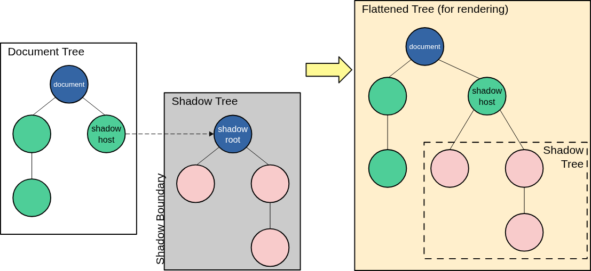
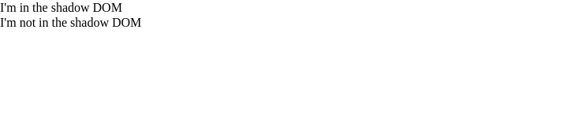
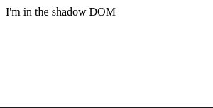
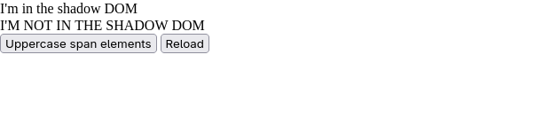
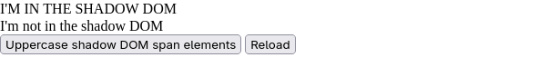
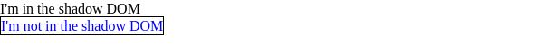
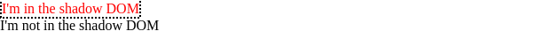
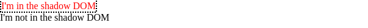

#WebComponents 
>[!NOTE]
>Shadow DOM permite adjuntar un árbol DOM a un elemento, y tener los internos de este árbol ocultos del Javascript y CSS que se ejecutan en la página.

*Shadow* DOM permite que árboles DOM ocultos se adjunten a elementos en el árbol DOM regular. Este árbol shadow DOM comienza con un shadow root, debajo del cual puedes adjuntar cualquier elemento, de la misma manera que el DOM normal.


Hay algunos términos de shadow DOM que debes conocer:
- **Shadow host**: El nodo DOM regular al que está adjunto el shadow DOM.
- **Shadow tree**: El DOM dentro del shadow DOM.
- **Shadow boundary**: El lugar donde termina el shadow DOM y comienza el DOM regular.
- **Shadow root**: El nodo raíz del shadow tree.
>[!NOTE]
>Puedes afectar los nodos en el shadow DOM exactamente de la misma manera que los nodos que no son shadow. La diferencia es que ningún código dentro de un shadow DOM puede afectar nada fuera de él, permitiendo un encapsulamiento útil.

## Herencia de atributos
El shadow tree y los elementos `<slot>` heredan los atributos `dir` y `lang` de su shadow host.
# Shadow DOM y elementos personalizados
Los elementos personalizados se implementan como una clase que extiende ya sea la base `HTMLElement` o un elemento HTML integrado como `HTMLParagraphElement`. Típicamente, el elemento personalizado mismo es un shadow host, y el elemento crea múltiples elementos debajo de esa raíz, para proporcionar la implementación interna del elemento.

```javascript
class FilledCircle extends HTMLElement {
  constructor() {
    super();
  }
  connectedCallback() {
    // Create a shadow root
    // The custom element itself is the shadow host
    const shadow = this.attachShadow({ mode: "open" });

    // create the internal implementation
    const svg = document.createElementNS("http://www.w3.org/2000/svg", "svg");
    const circle = document.createElementNS(
      "http://www.w3.org/2000/svg",
      "circle",
    );
    circle.setAttribute("cx", "50");
    circle.setAttribute("cy", "50");
    circle.setAttribute("r", "50");
    circle.setAttribute("fill", this.getAttribute("color"));
    svg.appendChild(circle);

    shadow.appendChild(svg);
  }
}

customElements.define("filled-circle", FilledCircle);
```

# Creando un shadow DOM
## Imperativamente con Javascript
La siguiente página contiene dos elementos, un elemento [`<div>`](https://developer.mozilla.org/en-US/docs/Web/HTML/Reference/Elements/div) con un [`id`](https://developer.mozilla.org/en-US/docs/Web/HTML/Reference/Global_attributes/id) de `"host"`, y un elemento [`<span>`](https://developer.mozilla.org/en-US/docs/Web/HTML/Reference/Elements/span) que contiene algún texto:
```html
<div id="host"></div>
<span>I'm not in the shadow DOM</span>
```
Vamos a usar el elemento "host" como el shadow host. Llamamos a `attachShadow()` en el host para crear el shadow DOM, y luego podemos añadir nodos al shadow DOM como lo haríamos con el DOM principal.
```javascript
const host = document.querySelector("#host");
const shadow = host.attachShadow({ mode: "open" });
const span = 
```

El resultado se ve así:

>[!IMPORTANT]
>Crear un **shadow DOM mediante la API de Javascript** podría ser una buena opción para **aplicaciones renderizadas del lado del cliente**.
# Declarativamente con HTML
Para otras aplicaciones, una UI renderizada del lado del servidor podría tener mejor rendimiento y una mejor experiencia de usuario. En tales casos puedes usar el elemento `<template>` para definir declarativamente el shadow DOM. La clave de este comportamiento es el atributo enumerado `shadowrootmode`, que puede establecerse como `open` o `closed`, los mismos valores que la opción mode del método `attachShadow()`.
```html
<div id="host">
  <template shadowrootmode="open">
    <span>I'm in the shadow DOM</span>
  </template>
</div>
```

>[!NOTE]
>Por defecto, los contenidos de `<template>` no se muestran. En este caso, debido a que se incluyó `shadowrootmode="open"`, el shadow root se renderiza. En navegadores compatibles, los contenidos visibles dentro de ese shadow root se muestran.

Después de que el navegador analiza el HTML, reemplaza el elemento `<template>` con su contenido envuelto en un shadow root que está adjunto al elemento padre, el `<div id="host">` en el ejemplo. El árbol DOM resultante se ve así:
```markdown
- DIV id="host"
  - #shadow-root
    - SPAN
      - #text: I'm in the shadow DOM
```

# Encapsulamiento de Javascript
Al hacer clic en el botón "Uppercase span elements" se encuentran todos los elementos `<span>` en la página y se cambia su texto a mayúsculas. Al hacer clic en el botón "Reload" simplemente se recarga la página, para que puedas intentarlo de nuevo.
```html
<div id="host"></div>
<span>I'm not in the shadow DOM</span>
<br />

<button id="upper" type="button">Uppercase span elements</button>
<button id="reload" type="button">Reload</button>
```
```javascript
const host = document.querySelector("#host");
const shadow = host.attachShadow({ mode: "open" });
const span = document.createElement("span");
span.textContent = "I'm in the shadow DOM";
shadow.appendChild(span);

const upper = document.querySelector("button#upper");
upper.addEventListener("click", () => {
  const spans = Array.from(document.querySelectorAll("span"));
  for (const span of spans) {
    span.textContent = span.textContent.toUpperCase();
  }
});

const reload = document.querySelector("#reload");
reload.addEventListener("click", () => document.location.reload());
```

Si haces clic en "Uppercase span elements", verás que `Document.querySelectorAll()` no encuentra los elementos en nuestro shadow DOM:

# Element.shadowRoot y la opción "mode"
Con `mode` establecido en `"open"`, el Javascript en la página puede acceder a los internos de tu shadow DOM a través de la propiedad `shadowRoot` del shadow host.

Esta vez el botón "Uppercase" usa `shadowRoot` para encontrar los elementos `<span>` en el DOM:
```html
<div id="host"></div>
<span>I'm not in the shadow DOM</span>
<br />

<button id="upper" type="button">Uppercase shadow DOM span elements</button>
<button id="reload" type="button">Reload</button>
```
```javascript
const host = document.querySelector("#host");
const shadow = host.attachShadow({ mode: "open" });
const span = document.createElement("span");
span.textContent = "I'm in the shadow DOM";
shadow.appendChild(span);

const upper = document.querySelector("button#upper");
upper.addEventListener("click", () => {
  const spans = Array.from(host.shadowRoot.querySelectorAll("span"));
  for (const span of spans) {
    span.textContent = span.textContent.toUpperCase();
  }
});

const reload = document.querySelector("#reload");
reload.addEventListener("click", () => document.location.reload());
```

>[!NOTE]
> El atributo `mode` es un string que especifica el modo de encapsulamiento para el árbol shadow DOM. Puede ser uno de:
> - `open`
> ```javascript
> element.attachShadow({ mode: "open" });
> element.shadowRoot; // Returns a ShadowRoot object
> ```
> - `closed`
> ```javascript
> element.attachShadow({ mode: "closed" });
> element.shadowRoot; // Returns null
> ```
>No debes **considerar esto un mecanismo de seguridad fuerte**, porque hay formas de evadirlo. Es más una **indicación de que la página no debería acceder** a los internos de tu árbol shadow DOM.
# Encapsulamiento de CSS
Esta vez, tendremos algo de CSS dirigido a elementos `<span>` en la página:
```html
<div id="host"></div>
<span>I'm not in the shadow DOM</span>
```
```javascript
const host = document.querySelector("#host");
const shadow = host.attachShadow({ mode: "open" });
const span = document.createElement("span");
span.textContent = "I'm in the shadow DOM";
shadow.appendChild(span);
```
```css
span {
  color: blue;
  border: 1px solid black;
}
```
El CSS de la página no afecta a los nodos dentro del shadow DOM:

# Aplicando estilos dentro del shadow DOM
Hay dos formas diferentes de aplicar estilos dentro de un árbol shadow DOM:
- Programáticamente, construyendo un objeto `CSSStyleSheet` y adjuntándolo al shadow root.
- Declarativamente, añadiendo un elemento `<style>` en la declaración de un elemento `<template>`.
En ambos casos, los estilos definidos en el árbol shadow DOM tienen alcance limitado a ese árbol.
## Hojas de estilo construibles (Constructable stylesheets)
Para estilizar elementos de página en el shadow DOM con hojas de estilo construibles, podemos:
1. Crear un objeto `CSSStyleSheet` vacío.
2. Establecer su contenido usando `CSSStyleSheet.replace()` o `CSSStyleSheet.replaceSync()`.
3. Añadirlo al shadow root asignándolo a `ShadowRoot.adoptedStyleSheets`.
Las reglas definidas en el `CSSStyleSheet` tendrán alcance limitado al árbol shadow DOM.
```html
<div id="host"></div>
<span>I'm not in the shadow DOM</span>
```

```javascript
const sheet = new CSSStyleSheet();
sheet.replaceSync("span { color: red; border: 2px dotted black;}");

const host = document.querySelector("#host");

const shadow = host.attachShadow({ mode: "open" });
shadow.adoptedStyleSheets = [sheet];

const span = document.createElement("span");
span.textContent = "I'm in the shadow DOM";
shadow.appendChild(span);
```

Los estilos definidos en el árbol shadow DOM no se aplican en el resto de la página:

## Añadiendo elementos `<style>` en declaraciones `<template>`
Una alternativa a construir objetos `CSSStyleSheet` es incluir un elemento `<style>` dentro del elemento `<template>` usado para definir un web component.

En este caso el HTML incluye la declaración `<template>`.
```html
<template id="my-element">
  <style>
    span {
      color: red;
      border: 2px dotted black;
    }
  </style>
  <span>I'm in the shadow DOM</span>
</template>

<div id="host"></div>
<span>I'm not in the shadow DOM</span>
```
```javascript
const host = document.querySelector("#host");
const shadow = host.attachShadow({ mode: "open" });
const template = document.getElementById("my-element");

shadow.appendChild(template.content);
```
De nuevo, los estilos definidos en el `<template>` se aplican solo dentro del árbol shadow DOM, y no en el resto de la página:

## Eligiendo entre opciones programática y declarativa
Crear un `CSSStyleSheet` y asignarlo al shadow root usando `adoptedStyleSheets` permite crear una sola hoja de estilo y compartirla entre muchos árboles DOM. El navegador analizará esa hoja de estilo una sola vez. También puedes hacer cambios dinámicos en la hoja de estilo y hacer que se propaguen a todos los componentes que usan la hoja.

El enfoque de adjuntar un elemento `<style>` es excelente si quieres ser declarativo, tienes pocos estilos y no necesitas compartir estilos entre diferentes componentes.
